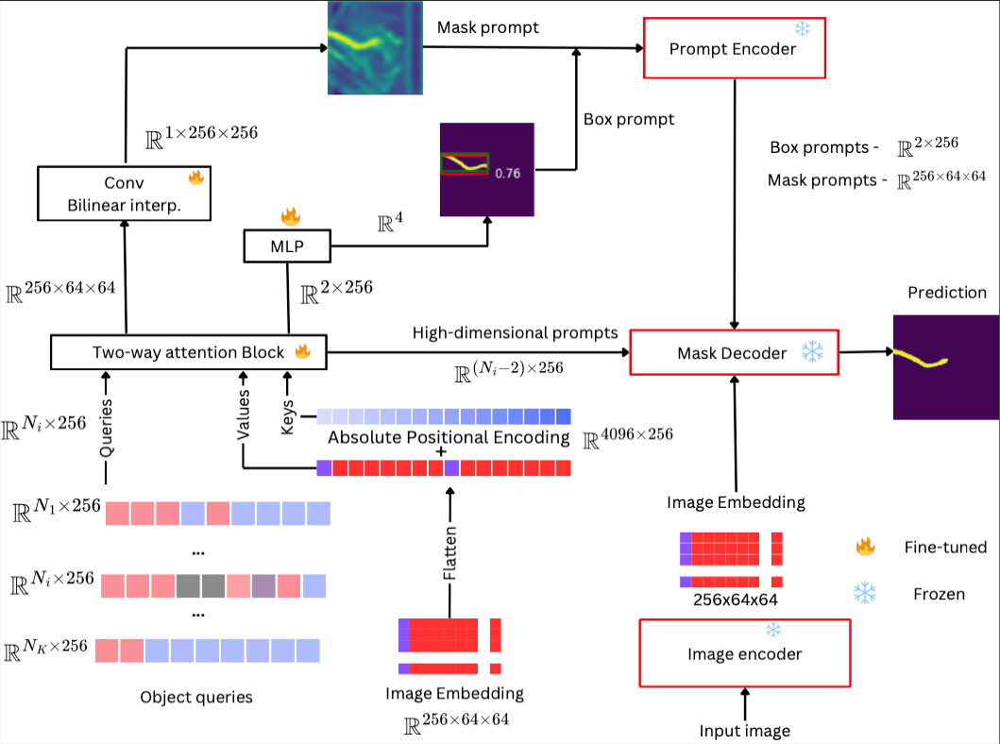

# Sam2rad: A Segmentation Model for Medical Images with Learnable Prompts

# Model



## Quickstart

**NOTE**: This will download a small dataset for demonstration purposes.

```bash
git clone https://github.com/nidus-lab/sam2rad.git
cd sam2rad
python3 -m venv .venv
source .venv/bin/activate
pip install -r requirements.txt
```

Download the weights [here](https://github.com/facebookresearch/segment-anything-2?tab=readme-ov-file#download-checkpoints) and place in the `weights` directory.

Start Training

```bash
source .venv/bin/activate
CUDA_VISIBLE_DEVICES=0 python train.py
```

Start Inference

```bash
source .venv/bin/activate
python ./examples/inference.py
```
# Models

**Currenty supported image encoders**
- sam_vit_b_adapter
- sam_vit_l_adapter
- sam_vit_h_adapter
- sam_vit_b
- sam_vit_l
- sam_vit_h
- vit_tiny
- All versions of Sam2 image encoder with/without adapters

**Currenty supported decoders**
- sam_mask_decoder
- lora_mask_decoder
- All versions of Sam2 mask decoder


# Citation
If you use this in your research, please consider citing the following paper:


```bibtex
@article{wahd2024sam2radsegmentationmodelmedical,
      title={Sam2Rad: A Segmentation Model for Medical Images with Learnable Prompts}, 
      author={Assefa Seyoum Wahd and Banafshe Felfeliyan and Yuyue Zhou and Shrimanti Ghosh and Adam McArthur and Jiechen Zhang and Jacob L. Jaremko and Abhilash Hareendranathan},
      year={2024},
      eprint={2409.06821},
      archivePrefix={arXiv},
      primaryClass={cs.CV},
      url={https://arxiv.org/abs/2409.06821}, 
}

